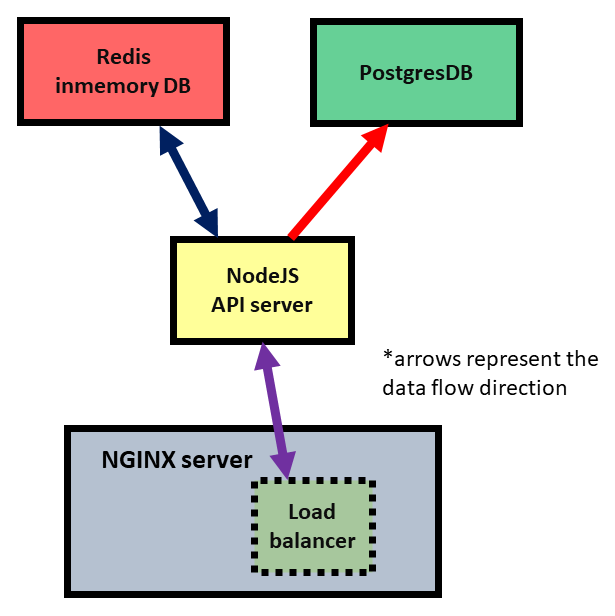

# Development

 - first ```make build```
 - then ```make dev```
 - press Ctrl-C to stop and then ```make down```


# Testing

 - in the second step, instead type ```make test```


# Architectural Design



